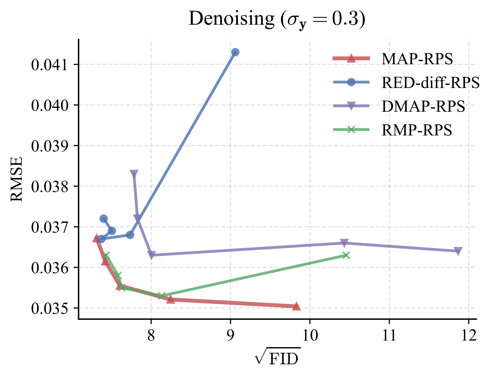

# Additional results for MAP-RPS

This repository provides supplementary experimental results for the anonymous submission.

---

### Figure R.Reply.1. Comparison of different initialization strategies in Stage 1.
We compare results obtained using different initializations: our MAP method, RED-diff (an existing MAP-based approach), DMAP (a ''local'' MAP solution), and RMP (another \textit{approximate} MMSE solution).

---

### Figure R.1. Comparison of different posterior sampling methods in Stage 2.
We show the D-P curve using DPS, $\Pi$GDM, and DMPS used in Stage 2 on the denoising task.

---

### Figure R.2. Results on challenging tasks.  
We include additional evaluations on more difficult tasks, including $8\times$ super-resolution, $25\%$ compressed sensing, and $128\times 128$ box inpainting. All the tasks apply noise with $\sigma_{\mathbf{y}}=0.1$.

---

### Figure R.3. Sample visualizations for challenging tasks.  
We present qualitative samples corresponding to the challenging tasks for better visual comparison.

---

### Figure R.4. CCDF comparison.  
We provide a simple comparison of CCDF and MAP-RPS to further illustrate the differences between methods.

### Table R.1. D-P traversal on hard tasks (for Reviewer N4k8, point 1; Reviewer gEN5, point 1; and Reviewer 6254, point 1).
D-P traversal of LMAP-RPS on $8\times$ Super-resolution, 25% Compressed Sensing and 128 x 128 Box Inpainting.

|||$t_0=0$|$t_0=100$|$t_0=200$|$t_0=300$|$t_0=400$|$t_0=500$|
|-|-|-|-|-|-|-|-|
|SR $8\times$|RMSE|0.0739|0.0749|0.0758|0.0761|0.0778|0.0804|
||FID|176.4|171.7|167.4|150.0|133.7|113.6|
|CS $25$%|RMSE|0.0577|0.0624|0.0654|0.0687|0.0748|0.0841|
||FID|165.5|160.6|149.6|138.4|133.2|127.1|
|Inp ($128$ box)|RMSE|0.0776|0.0780|0.0799|0.0830|0.0831|0.0835|
||FID|136.2|116.2|100.6|100.0|101.4|103.7|

### Table R.2. Comparison with CCDF (for Reviewer N4k8, point 2).
RMSE / FID for CCDF and MAP-RPS on FFHQ.
|Task|Algo|$t_0=0$|$t_0=25$|$t_0=50$|$t_0=75$|$t_0=100$|
|-|-|-|-|-|-|-|
|Inp|MAP-RPS|0.0336 / 82.33|0.0355 / 62.18|0.0369 / 55.02|0.0382 / 52.58|0.0392 / 53.47|
||CCDF|0.1510 / 145.0|0.1293 / 135.0|0.1161 / 121.1|0.1054 / 109.6|0.0960 / 106.1|
|||$t_0=0$|$t_0=100$|$t_0=200$|$t_0=300$|$t_0=400$|
|SR4|MAP-RPS|0.0547 / 133.8|0.0572 / 100.2|0.0596 / 85.74|0.0620 / 77.63|0.0633 / 78.54|
||CCDF|0.1101 / 253.5|0.0977 / 269.8|0.0832 / 157.3|0.0769 / 98.54|0.0666 / 85.30|

### Table R.3. Pixel-space comparison (for Reviewer J7Js, point 3).
Comparison of MAP-RPS and seven pixel-space inverse algorithms. Metrics are reported as PSNR / SSIM / LPIPS / FID.

|               | Inp                             | Deblur                          | SR$4\times$                     |
| ------------- | ------------------------------- | ------------------------------- | ------------------------------- |
| DDNM          | 33.6 / 0.917 / 0.151 / 58.1     | 29.8 / 0.843 / 0.219 / 80.5     | 28.8 / 0.824 / 0.243 / 88.5     |
| DPS           | 33.1 / 0.907 / 0.138 / 39.8     | 27.1 / 0.763 / 0.234 / 69.8     | 24.5 / 0.687 / 0.307 / 90.6     |
| RED-diff      | 28.5 / 0.765 / 0.316 / 103      | 27.7 / 0.776 / 0.326 / 98.3     | 26.9 / 0.668 / 0.443 / 124      |
| DMPS          | 27.9 / 0.834 / 0.229 / 89.9     | 28.1 / 0.799 / 0.265 / 97.1     | 26.0 / 0.745 / 0.308 / 112      |
| DiffPIR       | 30.7 / 0.859 / 0.236 / 97.5     | 27.6 / 0.777 / 0.304 / 114      | 25.5 / 0.719 / 0.347 / 120      |
| DAPS          | 30.5 / 0.779 / 0.239 / 61.5     | 28.7 / 0.783 / 0.277 / 77.4     | 27.7 / 0.765 / 0.294 / 86.7     |
| SITCOM        | 30.0 / 0.768 / 0.254 / 78.8     | 27.1 / 0.659 / 0.358 / 109      | 24.7 / 0.543 / 0.505 / 156      |
| MAP-RPS (0)   | 34.8 / 0.903 / 0.163 / 47.7     | **31.6** / 0.857 / 0.239 / 68.6 | **29.1** / 0.822 / 0.289 / 93.9 |
| MAP-RPS (300) | **35.8 / 0.943 / 0.110 / 36.5** | 30.7 / **0.865 / 0.178 / 56.9** | 28.8 / **0.826 / 0.232 / 75.4** |

### Table R.4. Comparison under same NFEs (for Reviewer J7Js, point 2).
Comparison of LMAP-RPS and other latent-space methods under the same NFEs of 200.

||NFEs|Inp|Deblur|
|-|-|-|-|
|Latent-DPS|200|21.9 / 0.553 / 0.451 / 203|17.4 / 0.386 / 0.531 / 316|
|Resample|200|24.2 / 0.646 / 0.372 / 163|24.6 / 0.627 / 0.398 / **98.5**|
|PSLD|200|25.2 / 0.660 / 0.412 / 131|23.2 / 0.612 / 0.457 / 131|
|STSL|200|27.7 / 0.777 / 0.306 / 91.5|22.0 / 0.533 / 0.479 / 167|
|LDIR|200|27.9 / 0.788 / 0.312 / 78.4|26.0 / 0.723 / **0.377** / 108|
|Latent-DCDP|200|26.9 / 0.765 / 0.321 / 80.5|25.5 / 0.693 / 0.384 / 107|
|Latent-DMAP|200|27.2 / 0.764 / 0.328 / 101|24.7 / 0.672 / 0.425 / 137|
|Latent-DAPS|200|25.9 / 0.694 / 0.396 / 104|23.7 / 0.585 / 0.456 / 139|
|Latent-SITCOM|200|27.0 / 0.753 / 0.374 / 126|23.6 / 0.627 / 0.466 / 184|
|LMAP-RPS (0)|200|**28.1 / 0.799 / 0.277 / 61.4**|**25.0 / 0.700** / 0.389 / 108|

### Table R.5. Comparison of different posterior sampling methods (for Reviewer J7Js, point 4; and Reviewer gEN5, point 4).
Comparison of the D-P tradeoff of MAP-RPS with DPS, $\Pi$GDM, and DMPS.
|||$t_0=0$|$t_0=25$|$t_0=50$|$t_0=75$|$t_0=100$|
|-|-|-|-|-|-|-|
|MAP-RPS (DPS)|RMSE|0.0350|0.0352|0.0356|0.0362|0.0367|
||FID|96.64|67.99|57.87|55.10|53.49|
|MAP-RPS ($\Pi$GDM)|RMSE|0.0350|0.0352|0.0365|0.0374|0.0384|
||FID|96.64|84.14|74.06|70.93|69.65|
|MAP-RPS (DMPS)|RMSE|0.0350|0.0358|0.0385|0.0413|0.0446|
||FID|96.64|86.22|75.10|68.75|66.27|