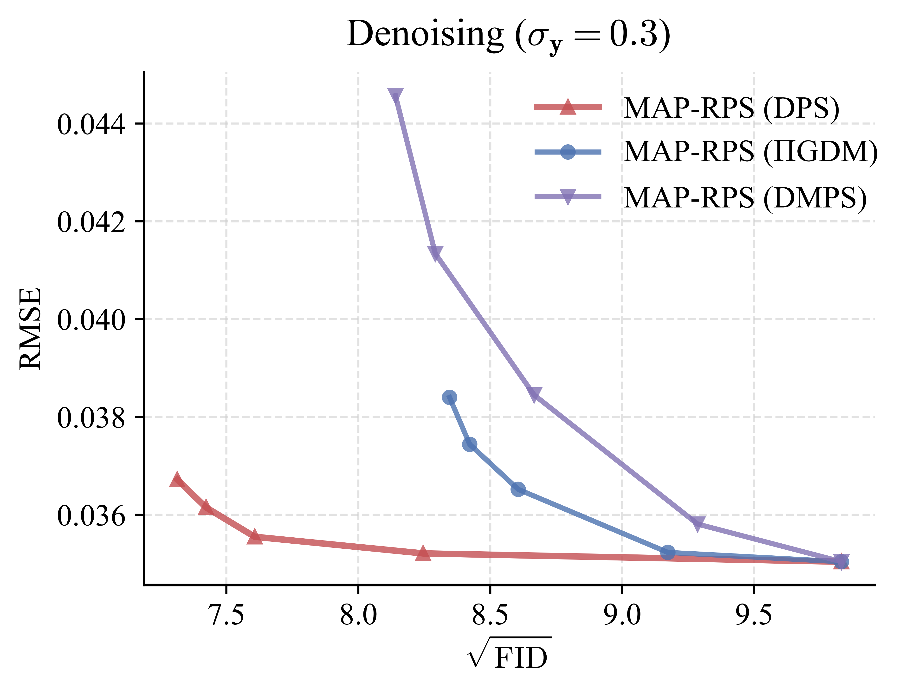
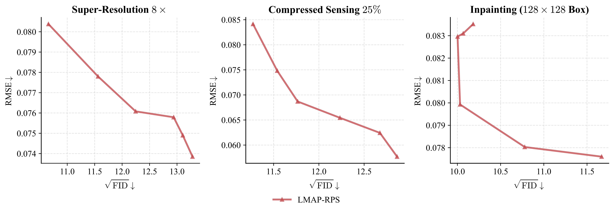
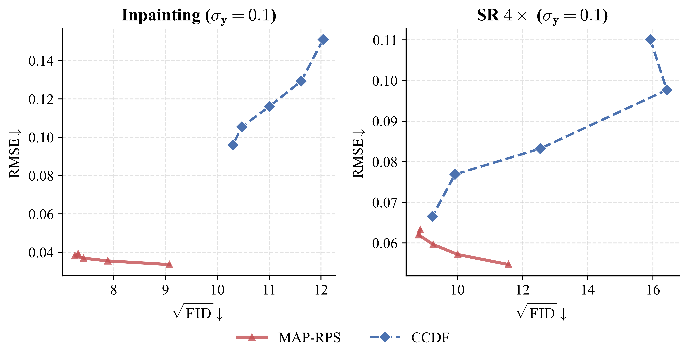

# Additional results for MAP-RPS

This repository provides supplementary experimental results for the anonymous submission.

---

### Figure R.1. Comparison of different posterior sampling methods in Stage 2.
We show the D-P curve using DPS, $\Pi$GDM, and DMPS used in Stage 2 on the denoising task.

---

### Figure R.2. Results on challenging tasks.  
We include additional evaluations on more difficult tasks, including $8\times$ super-resolution, $25\%$ compressed sensing, and $128\times 128$ box inpainting.

---

### Figure R.3. Sample visualizations for challenging tasks.  
We present qualitative samples corresponding to the challenging tasks for better visual comparison.

---

---

### Figure R.4. CCDF comparison.  
We provide a simple comparison of CCDF and MAP-RPS to further illustrate the differences between methods.

